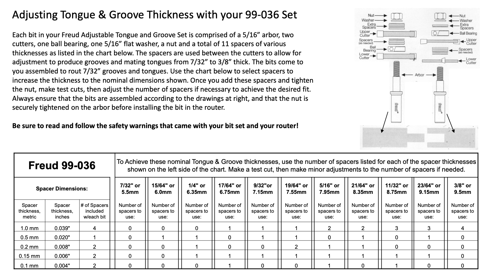

| Code   | Type            | Size           | RPMs    |
|--------|-----------------|----------------|---------|
| 2000A  | Roundover       | 1/16"          | 16k-18k |
| 2000B  | Roundover       | 3/32"          | 14k-16k |
| 2005C  | Roundover       | 1/8"           | 14k-16k |
| 2005   | Roundover       | 3/16"          | 14k-16k |
| 1085   | Dado            | 1/4"           | 14k     |
| SC218  | Dado            | 1/4" U.S. Ply  | 18-20k  |
| 1065A  | Dado            | 1/2" U.S. Ply  | 16-18k  |
| 1083A  | Dado            | 3/4" U.S. Ply  | 12-14k  |
| 1855   | Rabbet          | Adjustable     | 13-15k  |
| 55-502 | Lock Miter      | Small          | 14-16k  |
| 55-503 | Lock Miter      | Large          | 12-14k  |
| 99-036 | Tongue & Groove | Adjustable     | 12-14k  |

